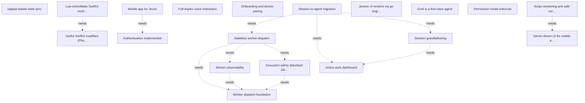

# Targets

<!-- last-evaluated: afe8751 -->

## Active

### 🎯T10 sqlpipe-based state sync
- **Value**: 13
- **Cost**: 13
- **Acceptance**:
  - WebSocket carries only sqlpipe peer messages — no application-level JSON messages
  - Server writes to transcript/sessions/scripts/state tables; changes stream to client automatically
  - Client writes to requests table; server processes inserts as actions
  - Reconnect uses diff sync — no full state resend
  - Lua scripts render from query subscription results
  - Chat, sessions, and status all reflect server state reliably without manual push logic
- **Context**: Desired state: all state synchronisation between jevonsd and the iOS
app flows through sqlpipe bidirectional peer sync over the existing
WebSocket. No application-level message protocol — the WebSocket is a
pure sqlpipe transport.

Architecture:
- jevonsd is a sqlpipe Peer (server-owned tables: transcript, sessions, scripts, state).
- iOS app is a sqlpipe Peer (client-owned tables: requests, preferences).
- Diff sync on reconnect via sqlpipe's hash-based protocol.
- Query subscriptions: Lua scripts receive live query results as state.
- Local query + subscribe in Lua; data flow is changeset arrives → subscribed queries re-evaluate → Lua runs → SwiftUI renders.

Integration: sqlpipe Go wrapper (go/sqlpipe/) for jevonsd, sqlpipe C++
API via bridging header for iOS. Replaces all WebSocket message types
(init, history, text, status, user_message, sessions, scripts,
notification, view, dismiss, action) with table reads/writes.

Dependencies: `marcelocantos/sqlpipe` (sibling repo).

Status: `internal/sync/` compiles cleanly with SyncManager, wire
framing, and state writes. iOS sqlpipe vendor exists. Protocol not yet
converted to pure sqlpipe transport.

- **Status**: Converging
- **Discovered**: 2026-03-15

### 🎯T11 Lua-controllable SwiftUI modifier surface
- **Value**: 8
- **Cost**: 5
- **Acceptance**: All sub-targets achieved
- **Context**: Desired state: SwiftUI behavioral modifiers are exposed as Lua props
so the server-driven UI has full control over rendering behavior
without Swift code changes.

- **Depends on**: 🎯T11.1, 🎯T11.2
- **Tags**: visual
- **Status**: Identified
- **Discovered**: 2026-03-15

### 🎯T11.2 Useful SwiftUI modifiers (Phase 2)
- **Value**: 3
- **Cost**: 3
- **Acceptance**:
  - 25 additional props for richer interactions and visual polish
  - Input: secure, content_type, line_limit_min, line_limit_max
  - Scroll: scroll_indicators, scroll_axis
  - Layout: frame_min_width, frame_min_height, aspect_ratio, clip_shape
  - Visual: shadow_radius, border_color, border_width, tint, resizable
  - Typography: text_case, monospaced, text_selection, multiline_alignment
  - Interaction: long_press_action, context_menu, confirmation, alert (structured props as child node types, matching swipe_action pattern)
  - Navigation: pull_to_refresh
  - Accessibility: a11y_hint, a11y_hidden
  - Animation: transition
- **Depends on**: 🎯T11.1
- **Status**: Identified
- **Discovered**: 2026-03-15

### 🎯T12 Script versioning and safe mode
- **Value**: 8
- **Cost**: 5
- **Acceptance**:
  - Script updates create versioned snapshots in SQLite
  - Two-finger chevron gesture triggers safe mode from any screen state
  - Safe mode screen renders without Lua, shows version info, allows one-tap rollback
  - Rollback restores all scripts to the selected snapshot atomically
  - Control channel messages bypass the Lua layer entirely
  - Smoke test; push a broken script, verify safe mode activates and rollback restores the working UI
- **Context**: Desired state: Lua script updates are versioned. If a script change
breaks the UI, the user can roll back to the last known-good version
without depending on the Lua layer.

Architecture:
- Script versioning: `script_versions` table in SQLite keeps last N versions per script.
- Control channel: WebSocket has a reserved message namespace below the Lua layer.
- Safe mode trigger: two-finger chevron gesture recognised at UIWindow level in Swift.
- Safe mode screen: pure Swift, shows version info, rollback button, raw log.

- **Depends on**: 🎯T9
- **Status**: Identified
- **Discovered**: 2026-03-21

### 🎯T13 Full-duplex voice interaction
- **Value**: 13
- **Cost**: 5
- **Acceptance**:
  - Speak in browser → Grok transcribes → response spoken aloud
  - Speak on iPad (WKWebView) → same flow via native audio bridge
  - Barge-in: speak during Grok's response to interrupt
  - Local VAD filters background noise (car cabin test)
  - Latency: utterance end to first audio response < 3 seconds
- **Context**: Desired state: the user has a full-duplex voice conversation with
jevons. Speech is transcribed, responses are spoken aloud, and barge-in
interruption works naturally. Works in both browser and iOS app.

Architecture (Option B: Grok voice + Claude brain):
- Grok Realtime API (wss://api.x.ai/v1/realtime) handles full-duplex voice I/O with server-side VAD and barge-in. Grok is the conversational voice layer.
- `send_to_jevons` tool: Grok calls this to delegate substantive work to the Claude jevons process. Returns immediately; Claude's response is injected back into the Grok session for TTS.
- Local adaptive VAD: browser/iOS runs noise-adaptive VAD (RMS with hysteresis, 300ms pre-buffer, 800ms hold). Only sends audio during detected speech.
- Transport abstraction (transport.js): identical API for browser (WebSocket) and iOS (native JS bridge with handle-based audio).
- Native audio (iOS): mic via AVAudioEngine, playback via AVAudioPlayerNode. Audio bytes never touch JS — only handles and RMS values.

Supersedes: OpenAI Realtime STT-only approach.

Collapses into 🎯T18: when Grok becomes the overseer agent, the voice
bridge and agent become one — no `send_to_jevons` indirection.

Status: Grok Realtime voice bridge working in browser (speech →
transcription → response → TTS). Adaptive local VAD, transport
abstraction, native iOS bridge all built. Remaining: test voice
end-to-end on iPad via WKWebView, verify latency is acceptable.

- **Status**: Converging
- **Discovered**: 2026-03-21

### 🎯T14 Onboarding and device pairing
- **Value**: 8
- **Cost**: 8
- **Acceptance**:
  - `brew install` installs both `jevons` CLI and `jevonsd` daemon
  - `jevons --init` runs the pairing ceremony end-to-end
  - Device secret persists in iOS Keychain; hash in jevonsd's DB
  - Subsequent connections authenticate automatically
  - `jevons --unpair` revokes a paired device
  - No manual host/port entry in the app
  - jevonsd runs as a brew service
  - Relay runs on Fly.io
- **Context**: Desired state: a new user goes from zero to connected in one flow with
no manual IP entry or configuration.

Onboarding flow:
1. User installs the iOS app. App opens a QR scanner and displays a brew install hint.
2. `jevons --init` prompts for OpenAI API key, stores in macOS Keychain.
3. CLI pings jevonsd (brew service) that the key is available.
4. jevonsd generates a one-time auth token, encodes host:port+token as QR, sends to CLI.
5. User points device at the QR on terminal.
6. App scans QR, connects to jevonsd with token, jevonsd promotes connection.

Relay architecture: Go relay on Fly.io (`carrier-pigeon.fly.dev`). Each
jevonsd connects outbound to `/register`, gets instance ID. iOS connects
to `/ws/<instance-id>`. Relay bridges traffic. No per-user DNS, no
tunnels, one relay for all users.

Pairing ceremony: CLI prompts for key; jevonsd generates single-use
pairing token; CLI displays QR; user scans; app sends pairing token;
jevonsd sends 6-digit confirmation code; user types code into CLI;
jevonsd generates persistent device secret; app stores secret in iOS
Keychain. Subsequent connections use device fingerprint
(identifierForVendor) + stored secret.

- **Status**: Identified
- **Discovered**: 2026-03-21

### 🎯T16 Session-to-agent migration
- **Value**: 13
- **Cost**: 13
- **Acceptance**: All sub-targets achieved
- **Context**: Desired state: standalone Claude Code sessions — the ones Marcelo runs
directly in terminals — are progressively absorbed into Jevon's agent
hierarchy (PO → Boss → Worker). Jevons has full visibility into where
active work is happening across all repos and can manage those
sessions as first-class agents.

- **Depends on**: 🎯T8, 🎯T16.1, 🎯T16.2
- **Status**: Identified
- **Discovered**: 2026-03-27

### 🎯T16.1 Active work dashboard
- **Value**: 8
- **Cost**: 5
- **Acceptance**:
  - Tool queries memory DB for recent interactive sessions, groups by repo
  - Tool scans ~/work/github.com/ for repos with uncommitted changes or non-default branches
  - Tool checks GitHub API for open PRs on repos with activity
  - Output is a unified table: repo, last session activity, working tree state, open PRs, agent assignment
  - Repos with no activity across any signal are omitted by default
- **Context**: Desired state: `jevons_active_work` MCP tool cross-references three
signals (recent transcript sessions, dirty working trees, open PRs) to
produce a unified per-repo view of where active work is happening.

Plan in `docs/plans/active-work-dashboard.md`.

- **Status**: Identified
- **Discovered**: 2026-03-27

### 🎯T16.2 Session grandfathering
- **Value**: 8
- **Cost**: 8
- **Acceptance**:
  - A session from the memory DB can be linked to an agent definition with a name, repo association, and session ID
  - Grandfathered agents appear in `jevons_agent_list` with their status
  - Grandfathered agents can receive messages via `jevons_agent_send`
  - A grandfathered session can be promoted to PO status or assigned under an existing PO
  - Sessions idle beyond a configurable threshold are flagged for retirement
- **Context**: Desired state: a standalone Claude Code session can be registered
("grandfathered") as an agent in Jevon's agent registry, making it
visible in `jevons_agent_list` and addressable via `jevons_agent_send`.

- **Depends on**: 🎯T16.1
- **Status**: Identified
- **Discovered**: 2026-03-27

### 🎯T17 Jevons UI renders via ge engine
- **Value**: 3
- **Cost**: 21
- **Acceptance**:
  - Jevon's UI runs as a C++ ge application alongside jevonsd
  - ge app renders UI and communicates with jevonsd over WebSocket/HTTP
- **Context**: DEFERRED (commit 3b1998b): bgfx requires reimplementing markdown
rendering, terminal emulation, text input, and layout from scratch.
Web view (WKWebView) or native SwiftUI (🎯T9) are better paths for
the car-mounted iPad use case.

Desired state (if revisited): Jevon's UI is a C++ ge application
running as a separate process alongside jevonsd (Go). The ge app
renders the UI and communicates with jevonsd over WebSocket/HTTP
(same protocol the web UI uses today).

Revisit only if ge's scene protocol matures to the point where
streaming rendered frames to iPad becomes practical.

- **Status**: Identified
- **Discovered**: 2026-03-29

### 🎯T18 Grok is a first-class agent
- **Value**: 13
- **Cost**: 8
- **Acceptance**:
  - `Agent` interface in Go with Claude and Grok implementations
  - Grok agent receives all MCP tools as function definitions
  - Grok agent can be started, sent messages, and emits events in the same format as Claude agents
  - Registry supports mixed agent types
  - `--jevons-model grok` starts Grok as the overseer with native voice
  - `--jevons-model claude` (default) preserves current behavior
  - Voice works end-to-end when Grok is the overseer: speak → Grok hears → tool calls → spoken response
- **Context**: Desired state: Grok can operate in any role in the agent hierarchy,
including as the root jevons overseer. The agent system is
model-agnostic — Claude and Grok agents are interchangeable via a
common interface. When Grok is the overseer, voice is native (no
STT/TTS bridge layer); it hears the user directly and calls MCP tools
as Grok functions.

Architecture:
- Agent interface: abstract `Agent` with `Start`, `Send`, `OnEvent`, `Stop`. Claude implementation wraps the existing PTY process. Grok implementation connects via xAI Realtime WebSocket with function calling.
- MCP-to-function mapping: jevonsd's MCP tool definitions automatically mapped to Grok function definitions.
- Voice collapse: when Grok is overseer, voice bridge collapses into the agent's I/O — no `send_to_jevons` indirection.
- Registry supports both Claude and Grok agent types. Agent definitions specify model type. Jevons overseer's model configurable at startup.

Status: Grok Realtime voice bridge built and working (voice I/O,
function calling, `send_to_jevons` tool). Transport abstraction and
native iOS bridge in place. Claudia library extraction (v0.2.0) now
provides the Agent/Task abstraction foundation — the `Agent` interface
this target needs is partially realised. Remaining: unify Grok and
Claude under claudia's Agent interface, wire MCP→function mapping,
add `--jevons-model grok` path.

- **Status**: Converging
- **Discovered**: 2026-03-30

### 🎯T5 Authentication implemented
- **Value**: 8
- **Cost**: 13
- **Acceptance**:
  - mTLS is enforced on all jevonsd endpoints (HTTP, WebSocket, MCP)
  - QR-based device provisioning flow works end-to-end (scan QR on phone, device gets a client certificate)
  - internal/auth package has tests covering the provisioning and verification paths
  - Unauthenticated requests are rejected
- **Context**: Desired state: mTLS with QR-based device provisioning secures all surfaces.
The `internal/auth` package is fully implemented.

- **Depends on**: 🎯T4
- **Status**: Identified
- **Discovered**: 2026-03-08

### 🎯T6 Permission model enforced
- **Value**: 5
- **Cost**: 8
- **Acceptance**:
  - `--permission-mode bypassPermissions` removed from Jevon's invocation in internal/jevons/jevons.go
  - `--dangerously-skip-permissions` removed from worker spawning
  - Confirmation requests from Claude Code are routed to the user via the WebSocket protocol
  - Tests verify that permission-requiring actions trigger confirmation
- **Context**: Desired state: neither Jevons nor workers run with blanket permission
bypass. Permission tiers from the trust model (🎯T4) are enforced.

- **Depends on**: 🎯T4
- **Status**: Identified
- **Discovered**: 2026-03-08

### 🎯T7 Mobile app for Jevon
- **Value**: 20
- **Cost**: 20
- **Acceptance**:
  - Mobile app connects to jevonsd over a secure channel
  - User can send text commands and see streaming responses
  - User can view and manage worker sessions
  - App works on iOS (primary target - Pippa, iPad Air 5th gen)
- **Context**: Desired state: a phone app provides a UI for interacting with jevonsd —
sending commands, viewing responses, and managing workers.

Status: Phase 1 (chat), Phase 2 (QR discovery), and Phase 3 (session
list/management UI) done. Remaining: secure channel (depends on 🎯T5)
and real-device testing on Pippa.

- **Depends on**: 🎯T5
- **Tags**: visual
- **Status**: Converging
- **Discovered**: 2026-03-08

### 🎯T8 Stateless worker dispatch
- **Value**: 21
- **Cost**: 18
- **Acceptance**:
  - All sub-targets achieved
  - cworkers repo archived after absorption complete
- **Context**: Desired state: jevonsd dispatches work to on-demand Claude Code workers
via `jwork` MCP tool. Workers are disposable subprocesses — spawned per
task, observed via stdin/stdout, no pooling or implicit context
injection. Caller provides all context in the task description. SQLite
tracks workers for observability. cworkers absorbed into jevonsd.

Key design principles (from cworkers v0.14 overhaul):
- Workers that just do a job don't need session tracking — spawn, run, done.
- No shadow context injection — caller owns the task description.
- No worker pool — on-demand spawning is simpler; latency cost is acceptable.
- Progress via markdown heading extraction from worker output, not semantic understanding.
- Observability via SQLite + SSE for dashboard, but that's telemetry, not control state.

Alternative to evaluate: Grok's full-duplex realtime API as the primary
agent backend instead of Claude Code subprocesses. Trade-offs: vendor
lock-in to xAI, loss of Claude Code's tool ecosystem, unknown MCP
support. May be subsumed by 🎯T18.

Prior design: `docs/vision-v2.md` (superseded).

- **Depends on**: 🎯T8.1, 🎯T8.2, 🎯T8.3
- **Status**: Identified
- **Discovered**: 2026-03-14

### 🎯T8.1 Worker dispatch foundation
- **Value**: 8
- **Cost**: 5
- **Acceptance**:
  - `jwork` MCP tool accepts task text, optional cwd and model
  - Spawns `claude -p` subprocess, writes task to stdin, reads NDJSON from stdout
  - Returns result text when worker completes
  - Depth-controlled hierarchies (workers can call jwork up to max depth 3, with delegation guidance injected at higher depths)
  - Progress heartbeats via markdown heading extraction from worker output, throttled by heading depth and time window
- **Context**: Desired state: `jwork` MCP tool dispatches tasks to on-demand Claude
Code workers. Each worker is a fresh `claude -p` subprocess. Task
description is self-contained — no implicit context injection.

- **Status**: Identified
- **Discovered**: 2026-03-14

### 🎯T8.2 Worker observability
- **Value**: 5
- **Cost**: 5
- **Acceptance**:
  - SQLite tables: workers (id, task, status, model, cwd, started_at, ended_at), events (worker output lines)
  - SSE event hub: worker lifecycle events broadcast to dashboard
  - Dashboard shows active/completed workers with status and output
  - Per-worker token counts and outcomes recorded
- **Context**: Desired state: worker lifecycle and output tracked in SQLite for
dashboard visibility and post-hoc analysis.

- **Depends on**: 🎯T8.1
- **Status**: Identified
- **Discovered**: 2026-03-14

### 🎯T8.3 Execution safety absorbed (doit)
- **Value**: 8
- **Cost**: 8
- **Acceptance**:
  - Engine API (Evaluate, Execute) wired into worker command execution
  - L1/L2/L3 policy chain operational
  - Hash-chained audit log integrated with worker tracking
  - Capability registry configured
  - `jwork` results include policy decisions in metadata
- **Context**: Desired state: doit's policy engine operates as an execution safety
layer between workers and the OS.

- **Depends on**: 🎯T8.1
- **Status**: Identified
- **Discovered**: 2026-03-14

### 🎯T9 Server-driven UI for mobile app
- **Value**: 13
- **Cost**: 13
- **Acceptance**:
  - Lua runtime embedded in iOS app, running view scripts locally
  - jevonsd pushes script updates over WebSocket; client caches and executes them
  - Server sends state updates (messages, sessions, status), not view trees; client renders locally from state
  - `jevons_reload_views` MCP tool pushes updated scripts to connected clients
  - Generic SwiftUI renderer maps Lua-produced view trees to native views
  - No business logic in Swift — all view logic in Lua scripts
  - Smoke test; Jevons writes path abbreviation via conversation, pushes script update, phone re-renders without app rebuild
- **Context**: Desired state: the iOS app is a programmable thin client. Lua view
scripts run on the device, rendering native SwiftUI from local state.
jevonsd pushes script updates and state changes; the phone renders
locally. Jevons (the AI agent) can modify scripts at runtime to
reshape the UI without app rebuilds or redeployment.

Architecture:
- Client-side Lua (C Lua, ~25KB) on device against local state.
- Script distribution: jevonsd holds canonical scripts, pushes on connect/change.
- State protocol: structured state updates over WebSocket, merged into local state.
- Primitives, not components: fine-grained view schema (text, vstack, hstack, spacer, image, padding, background, etc.).
- Inline assets via SF Symbols, data URIs, or bundled assets.
- Dev flow: edit on server → push draft → preview → approve → promote.
- Reserved `embed` component for future ge wire protocol integration.

Current status: server-side Lua rendering works end-to-end. Pivoting to
client-side Lua execution. Go side has Lua runtime (gopher-lua), view
state manager, view schema, MCP reload tool. iOS side has generic
recursive SwiftUI renderer (`ServerView`). Remaining: embed C Lua in
iOS, port view builders to Swift bindings, change WebSocket protocol to
state updates not view trees, add draft/preview/promote flow.

- **Tags**: visual
- **Status**: Converging
- **Discovered**: 2026-03-14

## Achieved

### 🎯T1 Jevons' tool surface is locked down
- **Value**: 1
- **Cost**: 1
- **Acceptance**: All inappropriate Claude Code tools disabled via --disallowedTools
- **Context**: Achieved in cf54767. All inappropriate tools disabled via `--disallowedTools`.
- **Status**: Achieved
- **Discovered**: 2026-04-09
- **Achieved**: 2026-04-09

### 🎯T15 Protocol state machines are formally verifiable
- **Value**: 1
- **Cost**: 1
- **Acceptance**:
  - YAML-driven protocol framework generates Go, Swift, TLA+, and PlantUML from a single definition
  - Pairing ceremony modelled with Dolev-Yao adversary (8 attack capabilities)
  - MitM vulnerability found and fixed with HKDF-derived key-bound codes
  - TLC exhaustively verifies all 7 invariants (420K distinct states, 0 remaining, 3 seconds)
- **Context**: YAML-driven protocol framework generates Go, Swift, TLA+, and PlantUML
from a single definition (`protocol/pairing.yaml`). Pairing ceremony
modelled with Dolev-Yao adversary (8 attack capabilities). MitM
vulnerability found in ECDH key exchange (confirmation code not bound
to public keys) and fixed with HKDF-derived key-bound codes. TLC
exhaustively verifies all 7 invariants: 420K distinct states, 0
remaining, 3 seconds. Research paper and state-space explosion
write-up in `docs/papers/`.

- **Status**: Achieved
- **Discovered**: 2026-04-09
- **Achieved**: 2026-04-09

### 🎯T2 Conversational interaction model works end-to-end
- **Value**: 1
- **Cost**: 1
- **Acceptance**:
  - AskUserQuestion disabled
  - CLAUDE.md template instructs conversational questions
- **Context**: Achieved in 83cc4a4. AskUserQuestion disabled, CLAUDE.md template instructs conversational questions.
- **Status**: Achieved
- **Discovered**: 2026-04-09
- **Achieved**: 2026-04-09

### 🎯T3 Test coverage exists for core packages
- **Value**: 1
- **Cost**: 1
- **Acceptance**: All non-stub packages have tests
- **Context**: Achieved in cf45460 + 6215164. 61 tests across 7 packages. All packages with code have tests; untested packages (auth, cli, voice, worker) are empty stubs.
- **Status**: Achieved
- **Discovered**: 2026-04-09
- **Achieved**: 2026-04-09

### 🎯T4 Trust model defined for pre-1.0
- **Value**: 1
- **Cost**: 1
- **Acceptance**:
  - Trust model documented in docs/trust-model.md
  - Three permission tiers defined (autonomous, confirmed, prohibited)
  - WebSocket confirmation flow documented
  - STABILITY.md references the design
- **Context**: Trust model documented in `docs/trust-model.md` with three permission tiers (autonomous, confirmed, prohibited) and WebSocket confirmation flow. STABILITY.md updated to reference the design.
- **Status**: Achieved
- **Discovered**: 2026-04-09
- **Achieved**: 2026-04-09

### 🎯T11.1 Essential SwiftUI modifiers (Phase 1)
- **Value**: 5
- **Cost**: 3
- **Acceptance**:
  - 16 essential props un-hardcoding current behavior
  - Input: keyboard, autocorrect, autocapitalize, submit_label
  - Scroll: scroll_anchor, scroll_dismiss_keyboard, keyboard_avoidance
  - Layout: frame_width, frame_height, frame_max_width, frame_max_height
  - Visual: foreground_style, content_mode
  - Nav: title_display_mode
  - Accessibility: a11y_label
- **Context**: 16 essential props implemented, un-hardcoding core behavior.
- **Status**: Achieved
- **Discovered**: 2026-03-15
- **Achieved**: 2026-03-22

## Graph

